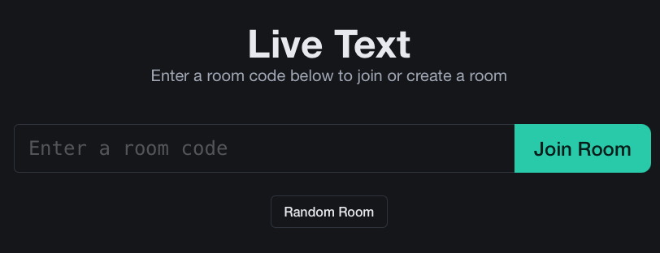

# Live Text

## About
LiveText is an open-source, self-hostable web application for creating temporary rooms in which you can exchange text data. Data is never stored on the server and nothing is saved permanently.




## Installation

### Using Docker
If you want to use Docker to run this app, just execute the following command:
```sh
docker run -p 3000:3000 ghcr.io/siveryt/livetext
```

### Native
1. Make sure you have **NodeJS v20 or later** installed.

2. Clone the repo and navigate into it:
    ```
    git clone https://github.com/siveryt/livetext.git
    cd livetext
    ```

3. Start the server via the server.js file:
    ```
    node server.js
    ```

4. If you want to change the port the server listens on, change the `PORT` environment variable, for example by using the .env file:
    ```
    PORT=3009
    ```

Then just open your browser, navigate to your IP and the port you specified (3000 is the default), and start using LiveText.

## Contributing

Contributions are welcome! If you have suggestions for improvements or new features, please refer to the [GitHub documentation on contributing to a project](https://docs.github.com/en/get-started/exploring-projects-on-github/contributing-to-a-project) for guidance. 

For bug reports, please use the [GitHub Issues](https://github.com/siveryt/livetext/issues) section to submit any issues you encounter.

## License
This project is licensed under the MIT License. See the [LICENSE](LICENSE) file for details.